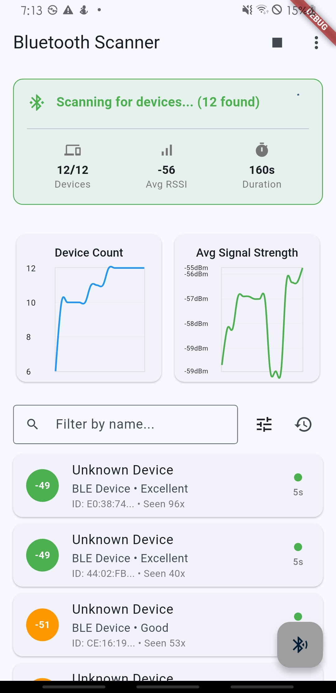
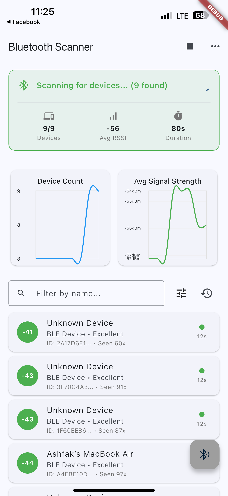

# Flutter Bluetooth Passive Sensing

A cross-platform Flutter application for passive Bluetooth device sensing and data visualization, created for Dartmouth Full Stack Developer interview challenge.

## Setup Instructions

### Prerequisites
- Flutter SDK 3.35.4+
- Dart 3.9.2+
- iOS 13.0+ / Android API 21+
- Xcode (for iOS development)

### Installation Steps

1. Clone the repository
   ```bash
   git clone git@github.com:ashfakshibli/flutter_passive_sensing.git
   cd flutter_passive_sensing/bluetooth_passive_sensing
   ```

2. Install Flutter dependencies
   ```bash
   flutter pub get
   ```

3. iOS Setup (macOS only)
   ```bash
   cd ios && pod install && cd ..
   ```

4. Run the application
   ```bash
   flutter run
   ```

## Implementation Approach

This Flutter application implements a Bluetooth passive sensing system using the MVVM (Model-View-ViewModel) architectural pattern for clean separation of concerns and maintainable code.

### Core Architecture

```
lib/
├── models/           # Data models and entities
│   ├── bluetooth_device_model.dart     # Bluetooth device representation
│   ├── scan_history_model.dart         # Scan session data
│   └── battery_optimization_config.dart # Power management settings
├── viewmodels/       # Business logic and state management
│   ├── bluetooth_scanning_viewmodel.dart # Main scanning logic
│   └── permission_viewmodel.dart       # Permission state management
├── services/         # Platform services and external APIs
│   ├── bluetooth_scanning_service.dart # Bluetooth Low Energy scanning
│   ├── database_service.dart           # SQLite data persistence
│   └── permission_service.dart         # Runtime permission handling
├── widgets/          # Reusable UI components
│   ├── bluetooth_scanning_screen.dart  # Main scanning interface
│   ├── simple_charts_widget.dart       # Time-series visualization
│   └── permission_widget.dart          # Permission request UI
└── utils/            # Helper classes and constants
    └── constants.dart                   # Application constants
```

### Key Technologies Used

- **flutter_blue_plus**: Bluetooth Low Energy scanning and device management
- **provider**: State management implementing MVVM pattern
- **sqflite**: Local SQLite database for time-series data storage
- **fl_chart**: Real-time data visualization with line charts
- **permission_handler**: Cross-platform runtime permission management
- **path_provider**: File system access for database storage

### Implementation Details

1. **Bluetooth Scanning**: Uses flutter_blue_plus for BLE device discovery with configurable scan intervals and filtering
2. **Data Storage**: SQLite database with relational schema for devices, scan sessions, and historical data
3. **State Management**: Provider pattern with separate ViewModels for different app concerns
4. **UI Architecture**: Modular widget composition with real-time data binding
5. **Permission Flow**: Comprehensive permission handling for Bluetooth and Location access

## Platform-Specific Considerations

### iOS Configuration
- **Minimum Version**: iOS 13.0 for flutter_blue_plus compatibility
- **Permissions**: NSBluetoothAlwaysUsageDescription and NSLocationWhenInUseUsageDescription in Info.plist
- **Background Modes**: bluetooth-central for background scanning capabilities
- **CocoaPods**: Native dependency management for Bluetooth libraries

### Android Configuration
- **Minimum SDK**: API 21 (Android 5.0) for BLE support
- **Target SDK**: API 34 (Android 14) with latest security requirements
- **Permissions**: BLUETOOTH, BLUETOOTH_ADMIN, ACCESS_FINE_LOCATION in AndroidManifest.xml
- **Runtime Permissions**: Dynamic permission requests for location access
- **Background Limitations**: Handles Android 12+ background execution limits

### Cross-Platform Considerations
- **Permission Handling**: Different permission flows for iOS and Android
- **Background Execution**: Platform-specific background scanning limitations
- **UI Adaptation**: Material Design with platform-appropriate styling
- **Database Path**: Platform-specific database file locations
- **Native Integration**: Proper handling of native Bluetooth APIs

## Battery Optimization Strategies

### 1. Intelligent Scan Intervals
- **Duty Cycling**: Implements 8-second active scanning followed by 7-second rest periods
- **Configurable Intervals**: User-adjustable scan durations (10s to 300s) based on use case
- **Adaptive Scanning**: Reduces scan frequency when no new devices detected

### 2. Efficient Data Management
- **Batch Operations**: Groups database writes to reduce I/O operations
- **Memory Optimization**: Limits in-memory device list size with LRU eviction
- **Smart Filtering**: Client-side filtering to reduce processing overhead
- **Lazy Loading**: Loads historical data only when needed for visualization

### 3. Background Optimization
- **Platform Awareness**: Respects iOS/Android background execution limits
- **Lifecycle Management**: Properly pauses/resumes scanning based on app state
- **Power Management**: Automatic scanning suspension during low battery states
- **Network Efficiency**: Local-only data storage without network requests

### 4. Hardware Resource Management
- **Bluetooth State Monitoring**: Responds to Bluetooth adapter state changes
- **Permission Caching**: Avoids repeated permission checks
- **UI Efficiency**: Minimal UI updates during background operation
- **Memory Management**: Proper resource cleanup and disposal patterns

### Code-Level Optimizations
```dart
// Duty cycle configuration for battery efficiency
class BatteryOptimizationConfig {
  final Duration scanDuration;     // Active scanning period
  final Duration restDuration;     // Power-saving rest period
  final int maxDevicesInMemory;    // Memory usage limits
  final bool enableBackgroundScanning; // Background capability toggle
}

// Efficient scanning service with power management
class BluetoothScanningService {
  Timer? _dutyCycleTimer;
  
  void _startDutyCycle() {
    _dutyCycleTimer = Timer.periodic(
      _config.scanDuration + _config.restDuration,
      (_) => _executeScanCycle(),
    );
  }
}
```

This implementation ensures optimal battery usage while maintaining effective Bluetooth device discovery and data collection capabilities across both iOS and Android platforms.

## Testing & Verification

### Tested Devices

#### ✅ Android
- **Successfully Tested On**: Samsung SM G965N (Galaxy S9+)
- **Android Version**: Android 10 (API 29)
- **Test Date**: October 2, 2025
- **Status**: ✅ All features working correctly including Bluetooth scanning, permissions, data storage, visualization, and background scanning

#### ✅ iOS
- **Successfully Tested On**: iPhone (Physical Device)
- **iOS Version**: iOS 18.6.2
- **Test Date**: October 2, 2025
- **Status**: ✅ All features working correctly including Bluetooth scanning, permissions, data storage, visualization, and background scanning

### Screenshots & Demo Videos

#### Android
<div align="center">
  
  <p><em>Android app showing active Bluetooth scanning with 12 devices detected, real-time charts, and device list</em></p>
</div>

**📹 Android Background Scanning Demo**  
[View Screen Recording](screenshots/Android_Screen_Recording_20251002-193558.mp4) - Demonstrates background scanning functionality, duty cycle optimization, and continuous device discovery on Android.

#### iOS
<div align="center">
  
  <p><em>iOS app showing active Bluetooth scanning with 9 devices detected, real-time charts, and device list</em></p>
</div>

**📹 iOS Background Scanning Demo**  
[View Screen Recording](screenshots/iOS_ScreenRecording_10-02-2025%2011-25-36_1.mov) - Demonstrates background scanning functionality, duty cycle optimization, and continuous device discovery on iOS.

### Test Coverage
- ✅ Bluetooth permission requests (iOS & Android)
- ✅ Location permission requests (iOS & Android)
- ✅ BLE device scanning and discovery (iOS & Android)
- ✅ Real-time device list updates (iOS & Android)
- ✅ SQLite database operations (iOS & Android)
- ✅ Time-series data visualization with charts (iOS & Android)
- ✅ Background scanning with duty cycle (iOS & Android)
- ✅ Battery optimization features (iOS & Android)
- ✅ App lifecycle management (iOS & Android)
- ✅ RSSI signal strength monitoring (iOS & Android)
- ✅ Device filtering and search (iOS & Android)
- ✅ Bluetooth adapter state checking (iOS & Android)

### Verified Features
- **Device Discovery**: Successfully detects and displays BLE devices in real-time
- **Signal Strength**: Displays RSSI values with color-coded indicators (Green: Excellent, Orange: Good, Red: Weak)
- **Real-time Charts**: Live updating charts showing device count and average signal strength over time
- **Background Scanning**: Continues scanning with configurable duty cycles (tested with 80s-160s durations)
- **Data Persistence**: All scan sessions and device data properly stored in SQLite database
- **Cross-Platform**: Identical functionality and UI across iOS and Android platforms

### Known Platform Behaviors
- **Android 10+**: Requires location services enabled for BLE scanning (tested and working)
- **iOS 13+**: Bluetooth permissions must be granted before scanning (tested and working)
- **Background Scanning**: Both platforms support background scanning within their respective execution policies
- **Permission Flow**: Smooth permission request handling on both platforms

### Corner Cases Handled
- **Bluetooth Adapter Disabled**: App checks if Bluetooth is enabled before starting scan. If disabled, displays user-friendly dialog prompting to enable Bluetooth
- **Permission Denied**: Full-screen permission gate with "Open Settings" button for permanently denied permissions
- **App Lifecycle**: Automatically pauses/resumes scanning when app goes to background/foreground
- **Background Limitations**: Adjusts scan duty cycle when in background mode to comply with platform restrictions
- **Empty Results**: Clear messaging when no devices found, with guidance to start scanning
- **Signal Strength Variations**: Color-coded RSSI indicators adapt to signal quality changes
- **Database Errors**: Graceful error handling with user-facing error messages
- **Duplicate Devices**: Smart device tracking by ID to prevent duplicate entries

---

Developer: Ashfak Md Shibli
Contact: shibli.emon@gmail.com